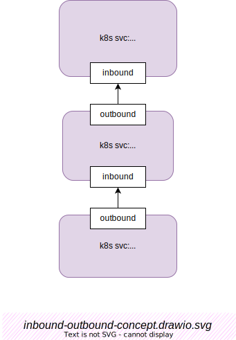

# 서비스 메시 개념

약속했던 대로, 이 책의 제목은 "Inside xyz"이지만, 왜 기본 개념을 다루는가? 그 이유는 다음과 같다:
- 내용의 완전성을 위해서.
- 앞으로 사용할 용어를 표준화하기 위해서.

## 서비스 호출 관계의 개념

## 업스트림(Upstream) & 다운스트림(Downstream)

Envoy의 관점에서 보면:

- `upstream`: 트래픽 방향에서의 역할 — [downstream] → envoy → **[upstream]**
- `downstream`: 흐름의 출발점 — **[downstream]** → envoy → [upstream]

```{warning}
 업스트림과 다운스트림은 관찰자 기준에 따라 달라지는 상대적인 개념이라는 점에 유의하라.

 시나리오: `서비스 A` ⤜ 호출 ➙ `서비스 B` ⤜ 호출 ➙ `서비스 C`

 - 우리가 `서비스 C`의 입장에 서 있다면, `서비스 B`는 다운스트림이다.

 - 반대로 `서비스 A` 입장에서 보면, `서비스 B`는 업스트림이다.
```

### 업스트림 클러스터 & 다운스트림 클러스터

`Upstream Cluster`와 `Downstream Cluster`는 주로 Envoy에서 사용되는 개념이다.

일반적으로 `Upstream` 또는 `Downstream`은 특정 호스트를 지칭한다. 반면 `Upstream Cluster` 또는 `Downstream Cluster`는 동일한 서비스를 같은 설정으로 실행하는 호스트 집합을 의미한다. 쿠버네티스(Kubernetes) 환경에서는 보통 동일한 `k8s Deployment` 내의 모든 POD들이 여기에 해당한다.

### 인바운드(Inbound) & 아웃바운드(Outbound)

Kubernetes Pod 관점에서 보면:

:::{figure-md} 인바운드 및 아웃바운드 개념



*그림: 인바운드 vs. 아웃바운드 개념*
:::
[Draw.io로 열기](https://app.diagrams.net/?ui=sketch#Uhttps%3A%2F%2Fistio-insider.mygraphql.com%2Fzh_CN%2Flatest%2F_images%2Finbound-outbound-concept.drawio.svg)

총 3개의 서비스가 있으며, 아래에서 위 방향으로 호출이 이루어진다:

1. client  
2. fortio-server:8080  
3. fortio-server-l2:8080

실제 호출 관계는 다음과 같다:

> client ➔ fortio-server:8080 ➔ fortio-server-l2:8080

위 다이어그램의 배치는 **up**stream과 **down**stream이라는 용어의 직관적인 의미를 시각적으로 표현하기 위한 의도이다. 다이어그램에서 설명이 필요한 부분은 인바운드 / 아웃바운드 용어뿐이다. 먼저 `bound`의 의미부터 보자.

- `bound`: 문자 그대로 경계(boundary)를 의미한다. 실제 Kubernetes + Istio 환경에서는 이 경계를 pod 또는 service로 해석할 수 있다.
- `inbound`: pod 외부에서 pod 내부로 들어오는 트래픽, 즉 서비스가 호출되는 방향의 트래픽.
- `outbound`: pod 내부에서 외부로 나가는 트래픽, 즉 서비스가 다른 서비스를 호출하는 트래픽.

> 주의: 동일한 호출 요청은 호출자 서비스 입장에서는 outbound이고, 피호출자 입장에서는 inbound일 수 있다는 점을 기억하라.
