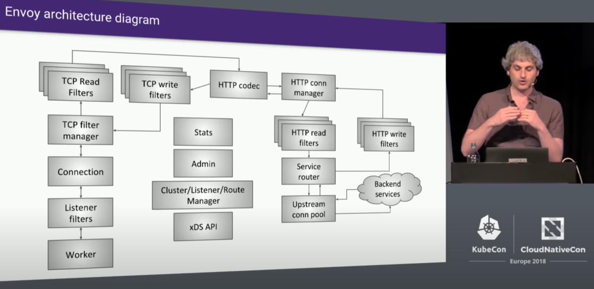

# 네이티브 프로그래머블 앰보이 (Native Programmable Envoy)

## 약간의 역사

나는 거대한 그림이나 역사 같은, 모두가 늘 알고 있는 얘기를 굳이 장황하게 말하는 걸 그리 좋아하진 않는다. 하지만 현재 상황의 원인을 이해하고 미래의 결과를 예측하려면, 약간의 역사 정도는 알고 있는 게 도움이 된다.

Envoy는 Lyft에 재직 중인 Matt Klein에 의해 만들어졌다. 서비스 메시(Service Mesh)의 프록시로 설계되었으며, Envoy 초기에는 Matt Klein 본인이 Google의 Istio 개발팀과 아주 밀접하게 협업했다. Istio와 Envoy는 언제나 공생 관계였다고 할 수 있는데 (지금은 Istio가 Envoy 외의 다른 에이전트를 사용할 수 있게 되었지만), 그래서 많은 사람들이 둘을 구분하지 못하기도 한다.

### 왜 C++인가?

“왜 Envoy를 C++로 구현했는가?” 이 질문은 Envoy에 입문한 사람들이 가장 많이 묻는 질문 중 하나다. Rust나 Go 같은 “안전한” 또는 “요즘 대세”인 언어가 인기인 시대에, 구식이고 학문적이며, 보안에 취약한 언어인 C++을 쓰는 건 뭔가 기피해야 할 일처럼 여겨진다.

Matt Klein의 대답은, Envoy가 처음 시작할 당시에는 C++이 최선의 선택이었다는 것이다. 20년 전에는 체계적으로 C++을 사용했지만 그 이후 20년간은 자바 커피를 마셔온 나로서는, Envoy 코드를 훑어보며 C++11의 사용이 상당히 자바스럽다는 인상을 받았다. 코드가 명확하고 이해하기 쉬우며, 일부 고수들이 초보자 접근을 막기 위해 쓰는 난해한 마법 코드는 사용하지 않는다. 이런 점은 오픈소스 프로젝트의 성공에 꼭 필요한 요소다.

## Envoy Proxy L1 아키텍처

L1은 가장 상위 수준의 아키텍처를 의미하며, OSI 모델의 네트워크 계층에서 말하는 L1과는 관계가 없다.
Matt Klein의 설명부터 시작해보자:

:::{figure-md} Envoy 전체 아키텍처

* 그림: Envoy 전체 아키텍처 — Envoy의 원 저자인 Lyft의 Matt Klein, 출처: [Envoy Internals Deep Dive - Matt Klein, Lyft (Advanced Skill Level)]
:::

이 다이어그램은 몇 년 전의 것이지만, 지금까지도 큰 변화는 없어 보인다. 여기서는 Envoy Internals 아키텍처 다이어그램 자체를 설명하지는 않겠다. 그보다는 Envoy를 둘러싼 환경부터 시작하고자 한다.

Istio의 컨트롤 플레인을 Envoy와 완전히 분리해서 분석하려는 건 아니다. 그런 분석은 큰 의미가 없기 때문이다. Envoy를 Istio와 무관하게 이야기하면, 종종 왜 Envoy가 그런 식으로 설계되었는지 이해하기 어렵다. 하지만 Istio가 Envoy를 어떻게 사용하는지를 고려하면서 Envoy의 설계를 설명하면, 왜 그렇게 만들어졌는지를 이해하기가 훨씬 쉬워진다.
